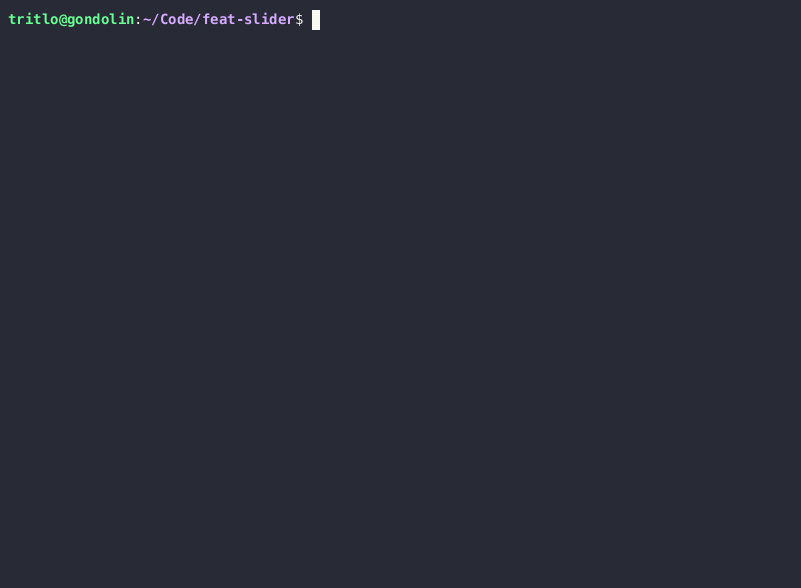

feat-slider
====

Don't you hate it when you have to input a value manually? Wouldn't it be much
better if there was a slider? Well now there is!

Run with `cabal run`, and enjoy.

If you want to change the type, compile with `cabal run --ghc-options=-DTYPE=Bool`.
Note however that it needs to be a finite type. If you set the size parameter
too big, it might also crash. Buyer beware!

Notes
---

Written as a joke, but also to play around with Brick.
